# Tom — Phased Development Plan

> Cross-platform local daemon + browser-based e-book manager.
> Zig 0.16 backend, Svelte/Vite frontend, SQLite storage.

---

## Design Decisions

### Library directory layout

```
<library_root>/
  <primary_author>/
    <title> (<book_id>)/
      cover.jpg
      <title>.epub
      <title>.pdf
```

The database is the source of truth for multi-author relationships, series
membership, and editions. The filesystem is human-browsable but uses the
numeric `book_id` to disambiguate collisions.

### Native schema (not Calibre)

```sql
books        (id, title, sort_title, isbn, language, publisher,
              pub_date, description, date_added, date_modified)
authors      (id, name, sort_name)
series       (id, name)
tags         (id, name)
book_authors (book_id, author_id, ordinal)   -- ordered many-to-many
book_series  (book_id, series_id, position)  -- book can appear in multiple series
book_tags    (book_id, tag_id)
formats      (id, book_id, format, file_path, file_size, file_hash)
```

Editions of the same work are separate `books` rows (different ISBN). A future
`editions` grouping table or tag convention can link them if needed.

### Asset serving strategy

| Mode    | Behavior |
|---------|----------|
| Dev     | Zig serves `/api/*`, Vite dev server serves frontend (proxy or separate port) |
| Release | `build.zig` runs `npm run build`, embeds `dist/` via `@embedFile` into a single binary |

---

## Dependency Strategy

| Dependency              | Acquisition                                        | Introduced |
|-------------------------|----------------------------------------------------|------------|
| SQLite amalgamation     | `build.zig.zon` URL dependency (official tarball)  | Phase 0    |
| EPUB test fixtures      | Public-domain files committed to `testdata/`       | Phase 2    |
| Svelte / Vite / TS      | `frontend/package.json`, `npm install` in build    | Phase 6    |
| epub.js or Foliate.js   | npm dependency in `frontend/`                      | Phase 9    |
| Calibre test fixture    | Synthetic `metadata.db` committed to `testdata/`   | Phase 11   |

No vendored source files from other projects. Everything comes through Zig's
package manager, npm, or CI-downloaded verified archives.

---

## CI Progression

| After Phase | CI Addition |
|-------------|-------------|
| 0 | `zig build test` on Linux + macOS |
| 3 | Integration test: import fixtures → assert DB + files |
| 5 | API lifecycle test: import → search → edit → delete |
| 6 | `npm ci && npm run build && zig build -Drelease test` |
| 8 | Multi-format import test |

---

## Phase 0 — Toolchain Spike & Project Scaffold

**Goal:** Prove Zig 0.16 + SQLite amalgamation + HTTP server compile and link
correctly on Linux and macOS. Eliminate toolchain risk before writing real
logic.

**Tasks:**

1. Add SQLite amalgamation (`sqlite3.c`, `sqlite3.h`) as a `build.zig.zon`
   URL dependency pointing to the official tarball.
2. `b.addTranslateC` step in `build.zig` to generate Zig bindings from
   `sqlite3.h`.
3. Thin Zig wrapper module (`src/db.zig`): `open()`, `exec()`, `prepare()`,
   `step()`, `close()` — just enough to prove translate-c output compiles.
4. Minimal `std.http.Server` in `src/main.zig` listening on a configurable
   port, responding `200 OK` to `GET /health`.
5. One test in `src/db.zig`: open in-memory SQLite → `CREATE TABLE` →
   `INSERT` → `SELECT` → assert value.

**Deliverable:**

- `zig build test` passes.
- `zig build run` → `curl localhost:8080/health` → `200 OK`.

**CI:** GitHub Actions workflow: `zig build test` on `ubuntu-latest` +
`macos-latest`.

> *The `/health` endpoint and test table are throwaway scaffolding. They exist
> solely to prove the toolchain.*

---

## Phase 1 — Native Schema & Storage Layer

**Goal:** Solid data-access layer with tested CRUD. No HTTP beyond the Phase 0
health endpoint.

**Tasks:**

1. Schema DDL as an embedded comptime string, executed on first open (creates
   all tables listed in the schema above).
2. Set pragmas on open: `journal_mode=WAL`, `synchronous=NORMAL`,
   `foreign_keys=ON`.
3. Repository module (`src/repo.zig`):
   - `insertBook(meta) → book_id`
   - `getBook(id) → ?Book`
   - `listBooks(offset, limit, filters) → []Book`
   - `updateBookMeta(id, patch)`
   - `deleteBook(id)` — cascades to formats, link tables
   - Author / series / tag upsert helpers
4. Structured error set for constraint violations, not-found, etc.
5. Tests: full CRUD cycle, multi-author linking, series ordering, tag
   filtering, edge cases (duplicate insert, delete non-existent).

**Deliverable:** `zig build test` exercises all repository operations against
in-memory SQLite.

---

## Phase 2 — EPUB Metadata Parser

**Goal:** Extract Dublin Core metadata from `.epub` files with zero external
dependencies beyond Zig's stdlib.

**Tasks:**

1. ZIP reader: use `std.compress` / `std.zip` to stream-read archive entries
   without extracting to disk.
2. Locate `META-INF/container.xml`, parse `rootfile` path to `.opf`.
3. Lightweight streaming XML parser (SAX-style, not full DOM) — sufficient to
   walk `<metadata>` in OPF and extract:
   - `dc:title`
   - `dc:creator` (with `opf:role="aut"` and `opf:file-as`)
   - `dc:language`, `dc:publisher`, `dc:date`, `dc:description`
   - `dc:identifier` (ISBN)
4. Cover image extraction: parse `<meta name="cover" content="..."/>` →
   manifest item → extract image bytes.
5. Return a `BookMeta` struct. No database coupling.
6. Commit 2–3 small public-domain EPUBs to `testdata/`.
7. Tests: parse each fixture, assert correct metadata fields.

**Deliverable:** `zig build test` parses real EPUB files and asserts correct
metadata extraction.

> *The XML parser can be minimal and purpose-built for OPF-shaped documents. It
> is acceptable to harden or replace it later.*

---

## Phase 3 — Library Filesystem & Ingest Pipeline

**Goal:** End-to-end import: file in → metadata parsed → file copied to
library tree → record in DB.

**Tasks:**

1. Library root configuration via CLI flag (`--library-path`).
2. Directory layout manager: given `BookMeta` + `book_id`, compute target
   path, create directories, copy/move file, write cover.
3. Import pipeline function: `importBook(file_path) → Result(book_id)`
   - Parse EPUB → `BookMeta`
   - Upsert authors / series / tags
   - Insert book + format record
   - Copy file to library tree
   - Extract and write cover image
4. Bulk scan: walk a directory, import every `.epub` found, skip duplicates
   (by file hash).
5. CLI entry point: `tom import <path>` (single file or directory).
6. Tests: import fixture EPUBs, verify DB records + filesystem layout.

**Deliverable:** `zig build run -- import testdata/` populates a library
directory with correct structure. Result inspectable via `sqlite3` CLI.

**CI:** Integration test that imports fixtures and asserts DB state + file tree.

---

## Phase 4 — HTTP API: Read Path

**Goal:** Serve the library over HTTP. Curl-testable, no frontend yet.

**Tasks:**

1. Router module: path matching with named parameter extraction
   (`/api/v1/books/:id`).
2. JSON serializer for `Book`, `Author`, `Series` structs (comptime
   reflection or manual).
3. Endpoints:
   - `GET /api/v1/books` — paginated list; query params: `offset`, `limit`,
     `author`, `series`, `tag`.
   - `GET /api/v1/books/:id` — full record with authors, series, tags,
     available formats.
   - `GET /api/v1/books/:id/cover` — serve cover image
     (`Content-Type: image/jpeg`).
   - `GET /api/v1/books/:id/file/:format` — binary streaming with
     `Accept-Ranges` / `Content-Range` (HTTP Range support).
4. Error responses: structured JSON
   `{"error": "not_found", "message": "..."}`.
5. Integration test: start server in a test, hit endpoints with
   `std.http.Client`, assert status codes + JSON shape.

**Deliverable:** `zig build run -- serve --library-path ./testlib` → browse
library via curl.

---

## Phase 5 — HTTP API: Write Path & Full-Text Search

**Goal:** Complete CRUD API + fast search.

**Tasks:**

1. `POST /api/v1/books/import` — multipart form upload, runs ingest pipeline
   from Phase 3.
2. `PATCH /api/v1/books/:id/metadata` — partial JSON update (title, authors,
   series, tags, description).
3. `DELETE /api/v1/books/:id` — remove DB record + files from library tree.
4. FTS5 virtual table:
   ```sql
   CREATE VIRTUAL TABLE books_fts USING fts5(
       title, authors, tags, description, content='books', content_rowid='id'
   );
   ```
5. Sync triggers: `INSERT` / `UPDATE` / `DELETE` on `books` keep `books_fts`
   current.
6. `GET /api/v1/books?q=<query>` routes to FTS5 `MATCH`, ranked by
   `bm25()`.
7. Tests: upload via multipart, search, update, delete, verify consistency.

**Deliverable:** Full CRUD + search exercisable via curl. `zig build test`
covers all endpoints.

**CI:** Integration test exercising the full API lifecycle (import → search →
edit → delete).

---

## Phase 6 — Minimal Web UI: Catalog Shell

**Goal:** First browser-usable interface. Read-only catalog browsing.

**Tasks:**

1. Svelte + Vite project in `frontend/` directory, TypeScript, minimal
   dependencies.
2. Build integration in `build.zig`:
   - Dev mode: Zig serves API on one port, Vite dev server on another
     (Vite proxies `/api` to Zig, or user opens both).
   - Release mode: `build.zig` invokes `npm run build`, then `@embedFile`s
     the `dist/` output into the binary.
3. Typed API client module in frontend (`lib/api.ts`).
4. Catalog view:
   - Cover grid (responsive CSS grid).
   - List view toggle.
   - Pagination (infinite scroll or page buttons).
   - Sort by: title, author, date added, date published.
5. Serve `index.html` for all non-`/api/` routes (SPA history fallback).

**Deliverable:** `zig build -Drelease run` → open browser → see book covers
in a grid. Single binary, no external files needed.

**CI:** `npm ci && npm run build && zig build -Drelease test`.

---

## Phase 7 — Web UI: Search, Filters & Detail Panel

**Goal:** Usable library management entirely in the browser.

**Tasks:**

1. Search bar wired to `GET /api/v1/books?q=` with debounce.
2. Sidebar or dropdown filters: author, series, tag (populated from
   dedicated API endpoints or faceted response).
3. Book detail panel (slide-in sidebar or dedicated route):
   - Cover, title, authors, series position, tags, description, formats,
     file sizes.
   - Download button per format.
4. Metadata edit form:
   - Inline-editable fields or edit-mode toggle.
   - Author / tag management (add / remove chips).
   - Save → `PATCH /api/v1/books/:id/metadata`.
5. Drag-and-drop file upload → `POST /api/v1/books/import`.
6. Toast notifications for success / error feedback.

**Deliverable:** End-to-end in browser: search → click book → view details →
edit metadata → save. Upload new books via drag-and-drop.

---

## Phase 8 — PDF Support & Multi-Format Handling

**Goal:** Import and serve PDFs alongside EPUBs.

**Tasks:**

1. PDF metadata extraction — options (choose one):
   - **Minimal native**: parse PDF header + `Info` dictionary in Zig (title,
     author, subject, keywords are plaintext fields in a known structure).
   - **External fallback**: shell out to `mutool info` or `pdfinfo` as an
     optional dependency (documented clearly).
2. Ingest pipeline detects `.pdf` extension, routes to PDF parser.
3. A book can have multiple formats (already modeled in `formats` table).
   Importing a PDF for a book that already has an EPUB adds a second
   format row.
4. UI: format badges on catalog cards, format picker in detail panel.
5. Tests: import PDF fixtures, verify metadata extraction, verify
   multi-format book record.

**Deliverable:** Import EPUBs and PDFs into the same library. UI shows format
badges. Download either format.

**CI:** Multi-format import test.

> *PDF metadata is often missing or wrong. The UI should make it easy to
> manually correct on import — this is already supported by the edit UI from
> Phase 7.*

---

## Phase 9 — In-Browser EPUB Reader

**Goal:** Read EPUBs without leaving the browser.

**Tasks:**

1. Evaluate and integrate a JS EPUB reader library (epub.js or Foliate.js),
   added as an npm dependency in `frontend/`.
2. "Read" button in detail panel opens a reader view / route.
3. Reader fetches the book via
   `GET /api/v1/books/:id/file/epub` (Range requests enable streaming).
4. Reading position persistence:
   - Phase 9: `localStorage` only.
   - Future: `PUT /api/v1/books/:id/progress` endpoint (Phase 12).
5. Basic reading settings: font size, light / dark / sepia theme,
   single / double page layout.
6. Back-to-catalog navigation.

**Deliverable:** Click "Read" → read an EPUB in the browser with basic
controls. Position remembered across sessions (client-side).

---

## Phase 10 — SSE Event Stream & Background Jobs

**Goal:** Non-blocking import with real-time progress feedback.

**Tasks:**

1. `GET /api/v1/events` — Server-Sent Events endpoint
   (`Content-Type: text/event-stream`).
2. Event types: `import:progress`, `import:complete`, `import:error`,
   `scan:progress`.
3. Background job runner: import and scan operations run on a separate
   thread via `std.Io.concurrent()`, emit events to the SSE stream.
4. Client-side `EventSource` integration: progress bar during upload /
   scan, toast on completion.
5. Single-session guard: if an SSE connection is already active, reject
   new connections with `409 Conflict` + a descriptive message.
6. Bulk re-scan endpoint: `POST /api/v1/library/scan` triggers background
   directory walk.

**Deliverable:** Drag-drop a batch of files → progress bar fills via SSE →
catalog updates live.

---

## Phase 11 — Calibre Compatibility Layer

**Goal:** Users with existing Calibre libraries can browse or migrate them.

**Tasks:**

1. Calibre schema analysis module: open `metadata.db`, map Calibre tables
   to native `BookMeta` structs.
2. Read-only adapter: `--calibre-library /path` flag opens a Calibre DB and
   serves it through the same API (writes disabled).
3. Migration CLI: `tom migrate --from-calibre <src> --to <dst>`
   - Walks Calibre DB, imports each book into native schema, copies files
     to native layout.
   - Handles Calibre custom columns as tags or description annotations
     (best-effort).
4. Tests using a small synthetic `metadata.db` committed to `testdata/`.

**Deliverable:** `tom serve --calibre-library ~/CalibreLibrary` → browse an
existing Calibre library in the browser (read-only). Or migrate it
permanently with `tom migrate`.

---

## Future Phases (out of current scope)

| Phase | Feature | Notes |
|-------|---------|-------|
| 12 | Reading progress sync (server-side) | `PUT /api/v1/books/:id/progress`, resume across devices |
| 13 | OPDS catalog feed | Expose library as OPDS for e-reader apps |
| 14 | Math / LaTeX → SVG pipeline | WASM KaTeX, EPUB rewriter, e-ink optimization |
| 15 | WAMR plugin runtime | Sandboxed WASM extensions |
| 16 | Multi-user & auth | JWT / session, per-user shelves, LAN sharing |
| 17 | Windows support | `std.Io` backend differences, installer |

---

## Summary

```mermaid
gantt
    title Tom Development Phases
    dateFormat X
    axisFormat %s

    section Foundation
    Phase 0  Toolchain Spike       :p0, 0, 1
    Phase 1  Schema & Storage      :p1, after p0, 1

    section Ingest
    Phase 2  EPUB Parser           :p2, after p1, 1
    Phase 3  Filesystem & Import   :p3, after p2, 1

    section API
    Phase 4  Read Endpoints        :p4, after p3, 1
    Phase 5  Write + FTS           :p5, after p4, 1

    section Frontend
    Phase 6  Catalog UI Shell      :p6, after p5, 1
    Phase 7  Search & Detail       :p7, after p6, 1

    section Formats
    Phase 8  PDF Support           :p8, after p7, 1
    Phase 9  EPUB Reader           :p9, after p8, 1

    section Infrastructure
    Phase 10 SSE & Background Jobs :p10, after p9, 1
    Phase 11 Calibre Compat        :p11, after p10, 1
```


